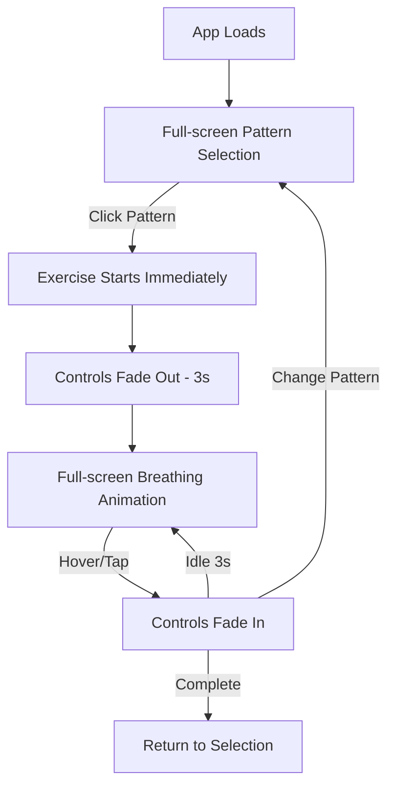

# Plan: Simplify App to Full-Screen Only View

## Overview

Simplify the breathing exercise app by removing the landing/card view entirely and making the full-screen view the only interface. Clicking an exercise immediately starts it, and all controls are hidden until the user hovers (desktop) or taps (mobile).

## Problem Statement

The current app has multiple views (landing, session, zen mode) creating unnecessary complexity. Users must:
1. See a landing page with pattern cards
2. Click a pattern to select it
3. Click "Begin" to start
4. Optionally enter "Zen Mode" for full-screen

This multi-step flow adds friction and reduces immersion.

## Proposed Solution

**Single full-screen interface:**
1. Pattern selection grid (full-screen) → Click pattern → Exercise starts immediately
2. All controls hidden by default, revealed on hover/tap
3. Speed +/- controls added to the hover UI
4. Remove separate session view entirely

## Technical Approach

### Architecture Changes



### Files to Modify

| File | Changes |
|------|---------|
| `app/(pages)/r3f/breathing/(components)/breathing-experience/index.tsx` | Remove `sessionStarted` state, remove landing view, make pattern selection full-screen, auto-start on pattern click |
| `app/(pages)/r3f/breathing/(components)/zen-mode/index.tsx` | Convert to main view, add idle-based control hiding, add speed controls |
| `app/(pages)/r3f/breathing/(components)/zen-mode/zen-mode.module.css` | Add hover/fade transitions for controls |
| `libs/breathing-store.ts` | Add `controlsVisible`, `showPatternSelection` states |
| `hooks/use-idle-controls.ts` | NEW - Hook for idle detection and control visibility |

### Files to Remove

| File | Reason |
|------|--------|
| Session view code in `breathing-experience/index.tsx` (lines 336-580) | Replaced by zen mode as main view |

## Implementation Phases

### Phase 1: Create Idle Controls Hook

Create `hooks/use-idle-controls.ts`:

```tsx
// hooks/use-idle-controls.ts
'use client'

import { useState, useEffect, useEffectEvent, useRef } from 'react'

interface UseIdleControlsOptions {
  idleTimeout?: number
  initialVisible?: boolean
}

export function useIdleControls({
  idleTimeout = 3000,
  initialVisible = true,
}: UseIdleControlsOptions = {}) {
  const [isVisible, setIsVisible] = useState(initialVisible)
  const timeoutRef = useRef<NodeJS.Timeout>()

  const handleUserActivity = useEffectEvent(() => {
    setIsVisible(true)
    if (timeoutRef.current) clearTimeout(timeoutRef.current)
    timeoutRef.current = setTimeout(() => setIsVisible(false), idleTimeout)
  })

  useEffect(() => {
    const events = ['mousemove', 'mousedown', 'touchstart', 'touchmove', 'keydown']
    events.forEach(e => window.addEventListener(e, handleUserActivity, { passive: true }))
    handleUserActivity()
    return () => {
      events.forEach(e => window.removeEventListener(e, handleUserActivity))
      if (timeoutRef.current) clearTimeout(timeoutRef.current)
    }
  }, [idleTimeout])

  return { isVisible, show: () => setIsVisible(true) }
}
```

### Phase 2: Update Zustand Store

Modify `libs/breathing-store.ts`:

```tsx
// Add to store interface
showPatternSelection: boolean

// Add actions
setShowPatternSelection: (show: boolean) => void
startPattern: (patternKey: string) => void // Combines select + play
```

### Phase 3: Simplify BreathingExperience

Transform `breathing-experience/index.tsx`:

- Remove `sessionStarted` state and all conditional rendering
- Make pattern selection grid full-screen
- Pattern click calls `startPattern()` and transitions to exercise view
- Remove "Begin" button flow entirely

```tsx
// breathing-experience/index.tsx (simplified structure)
export function BreathingExperience() {
  const showPatternSelection = useBreathingStore(s => s.showPatternSelection)

  if (showPatternSelection) {
    return <PatternSelectionGrid onSelect={handlePatternStart} />
  }

  return <BreathingSession />
}
```

### Phase 4: Convert Zen Mode to Main View

Transform `zen-mode/index.tsx`:

- Remove overlay/modal behavior (no longer triggered by button)
- Add `useIdleControls` hook for auto-hiding
- Wrap all controls in fade container
- Add speed +/- buttons
- Add "Change Pattern" button
- Connect to store timer (not independent timer)

```tsx
// zen-mode/index.tsx (simplified structure)
export function BreathingSession() {
  const { isVisible } = useIdleControls({ idleTimeout: 3000 })

  return (
    <div className={s.session}>
      <BreathingVisualizer />
      <BreathingWave />

      <div className={`${s.controls} ${isVisible ? s.visible : ''}`}>
        <SpeedControls />
        <PlayPauseButton />
        <AudioToggle />
        <ChangePatternButton />
        <CompleteButton />
      </div>
    </div>
  )
}
```

### Phase 5: Add CSS Transitions

Update `zen-mode.module.css`:

```css
.controls {
  position: fixed;
  bottom: 0;
  left: 0;
  right: 0;
  padding: 2rem;
  opacity: 0;
  visibility: hidden;
  pointer-events: none;
  transition: opacity 300ms ease, visibility 0s linear 300ms;
  background: linear-gradient(to top, rgba(0,0,0,0.5), transparent);
}

.controls.visible {
  opacity: 1;
  visibility: visible;
  pointer-events: auto;
  transition: opacity 300ms ease, visibility 0s linear 0s;
}
```

### Phase 6: Add Speed Controls Component

Create speed control UI within zen mode:

```tsx
// Inside zen-mode/index.tsx
function SpeedControls() {
  const adjustCycleSpeed = useBreathingStore(s => s.adjustCycleSpeed)
  const cycleSpeedAdjustment = useBreathingStore(s => s.cycleSpeedAdjustment)

  return (
    <div className={s.speedControls}>
      <button onClick={() => adjustCycleSpeed(-0.1)}>−</button>
      <span>{(1 + cycleSpeedAdjustment).toFixed(1)}x</span>
      <button onClick={() => adjustCycleSpeed(0.1)}>+</button>
    </div>
  )
}
```

## Acceptance Criteria

### Functional Requirements

- [ ] Pattern selection is full-screen (100vw × 100vh)
- [ ] Clicking a pattern immediately starts the exercise (no "Begin" button)
- [ ] Exercise view is full-screen with no chrome
- [ ] Controls hidden by default, fade in on hover (desktop) or tap (mobile)
- [ ] Controls auto-hide after 3 seconds of idle
- [ ] Speed +/- buttons present in control panel
- [ ] Speed adjustment works (using existing `adjustCycleSpeed` action)
- [ ] "Change Pattern" button returns to pattern selection
- [ ] "Complete Session" button ends exercise (after 10s minimum)
- [ ] Audio toggle preserved
- [ ] Play/pause preserved
- [ ] Escape key returns to pattern selection
- [ ] Previous landing view code removed entirely

### Non-Functional Requirements

- [ ] Control fade transition is smooth (300ms)
- [ ] No layout shift when controls appear/disappear
- [ ] Touch targets minimum 44×44px for mobile
- [ ] Works on all modern browsers (Chrome, Safari, Firefox, Edge)
- [ ] Existing tests pass after refactor

## Dependencies & Risks

### Dependencies

- Existing Zustand store structure
- Existing breathing timer hook
- Existing visualizer components

### Risks

| Risk | Mitigation |
|------|------------|
| Users confused by hidden controls | Controls visible for 3s on start; hover discovery is standard pattern |
| Speed change mid-cycle jarring | Apply at next cycle start (existing store behavior) |
| Mobile tap detection issues | Use pointer events, not just mouse events |

## Design Decisions

### Resolved

1. **Control visibility trigger**: Any mouse movement (desktop) or tap (mobile)
2. **Idle timeout**: 3 seconds
3. **Speed change timing**: Apply proportionally via existing `adjustCycleSpeed`
4. **Pattern switch**: Immediate (no confirmation dialog)
5. **Session completion**: Return to pattern selection immediately (no summary)

### Open Questions (if any)

None - proceeding with reasonable defaults.

## References

### Internal References

- Zustand store: `libs/breathing-store.ts:15-41` (state definition)
- Timer hook: `hooks/use-breathing-timer.ts:87-208` (animation loop)
- Pattern definitions: `libs/breathing-patterns.ts:22-140`
- Current zen mode: `app/(pages)/r3f/breathing/(components)/zen-mode/index.tsx:29-251`
- Current experience: `app/(pages)/r3f/breathing/(components)/breathing-experience/index.tsx:60-586`

### External References

- [React useEffectEvent Hook](https://react.dev/reference/react/useEffectEvent)
- [CSS visibility transitions](https://css-tricks.com/snippets/css/toggle-visibility-when-hiding-elements/)
- [Idle detection patterns](https://usehooks.com/useidle)
